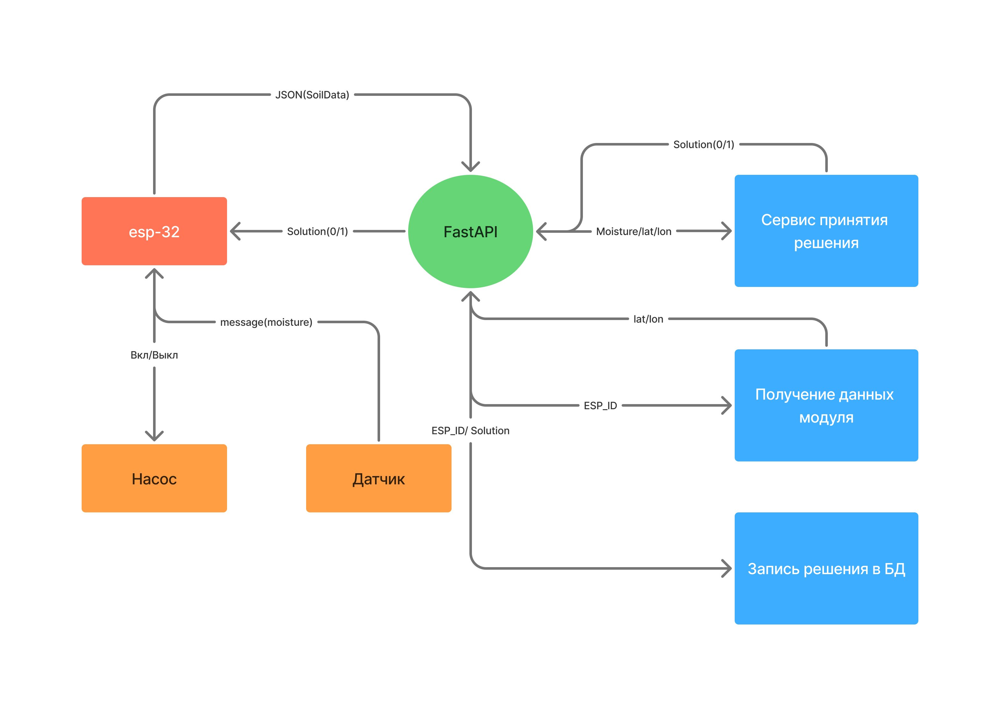

# Automatic Irrigation System

<div align="center">


</div>

**Система автоматического полива**, предназначенная для удалённого управления и контроля состояния огорода.


## Обзор архитектуры

Система построена на базе **FastAPI**.
ESP32 взаимодействует с backend через **HTTP API** и передаёт данные о состоянии системы в формате **JSON**.


### Принцип работы 
1. ESP32 отправляет на сервер данные о влажности почвы и **API-ключ**, который используется для аутентификации устройства.
2. На основе полученных данных FastAPI анализирует состояние почвы и принимает решение о необходимости полива.
3. При необходимости сервер отправляет ESP32 команду на запуск полива.

---

## Основные возможности

*   Удалённый контроль состояния системы.
*   Получение данных о влажности почвы.
*   Автоматическое принятие решения о необходимости полива.
*   Управление поливом через ESP32.
*   Аутентификация и авторизация пользователей.
*   Хранение данных пользователей и системы.
*   Хранение refresh-токенов.
*   Асинхронная обработка запросов.

---

## Стек технологий

### Backend & Язык
*   **Python** — основной язык разработки.
*   **FastAPI** — разработка REST API.
*   **asyncio** — асинхронная обработка операций.

### Хранение данных
*   **PostgreSQL** — хранение данных приложения.
*   **Redis** — хранение refresh-токенов пользователей.

### Безопасность
*   **JWT** — аутентификация и авторизация.

### Инфраструктура и инструменты
*   **SQLAlchemy** — взаимодействие с базой данных.
*   **Alembic** — миграции базы данных.
*   **Docker / Docker Compose** — контейнеризация приложения и инфраструктуры.
*   **Pytest / unittest** — тестирование.

### Аппаратная часть (Hardware)
*   **ESP32** — аппаратная часть системы.
*   **HTTP / JSON** — протокол взаимодействия ESP32 с backend.

## Установка и запуск

### 1. Создание виртуального окружения
```
python -m venv venv

# Windows
venv\Scripts\activate

# Linux / macOS
source venv/bin/activate
```

### 2. Установка зависимостей
```
pip install -r requirements.txt
```

### 3. Переменные окружения
создайте файл .env и заполните поля
```
REDIS_PWD = ""
REDIS_HOST = ""
REDIS_PORT = ""
POSTGRES_PWD = ""
POSTGRES_NAME = ""
POSTGRES_HOST = ""
```

### 5. Запуск 
```
uvicorn main:app --reload
```
Документация будет доступна по адресу http://localhost:8000/docs
